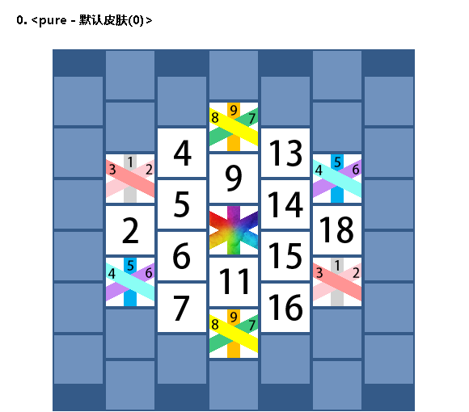

# comb-combat
游戏逻辑来自星星bot云顶之巢，作者使用python重写其功能

目前程序已经能实现基本的游戏逻辑，并且有简单的可视化 
将来可能用随机数种子来控制游戏，并添加编辑模式，优化代码结构，添加随机事件功能

## 游戏介绍

## 基本规则
### 回合制
每一回合分为放置阶段，对战阶段。放置阶段所有玩家行动后开启对战阶段
### 抽卡规则
游戏开始时初始化卡池1，卡池2。卡牌三个方向上都有数值，方向一有3，4，8，方向二有1，5，9，方向三有2，6，7共3\*3\*3=27种组合。卡池1为2\*27共54张牌，卡池2除了2\*27张牌还有两张万能牌（1000）共56张牌。初始回合从卡池1抽出人数张牌，然后每人随机分配一张。1+7n为选卡回合，从卡池1抽出人数+1张牌，按照玩家血量，分数，序号正序依次选择卡牌。其余回合为普通回合，从卡池2中抽出一张公共牌给所有玩家使用
### 放置规则
放置时，程序接收玩家的序号和放置的位置，如果是选卡阶段则额外接收选择的卡牌序号。位置的序号为0到19（如图），其中0不参与分数计算，放置到位置0相当于弃牌 
**目前接收玩家序号需要手动输入** 
一般回合玩家输入的格式为：position 
选卡回合玩家输入的格式为：card position 
position为0到19的整数，代表棋盘位置，card为选牌对应的序号，放置完成后立刻计算一次分数
### 算分规则
棋盘和每张牌有三个方向（左上-右下，上-下，右上-左下），当棋盘上棋子连满一整条线，如果这条线上棋子这个方向上的数字相同，则获得（数字\*长度）分，万能棋子（1000）可以视为任何数字与其他棋子连线
### 对战规则
玩家两两配对，如果人数为奇数，则添加一名镜像玩家。分数多的玩家对分数少的玩家造成伤害，伤害值等于分数差值\*伤害倍率
